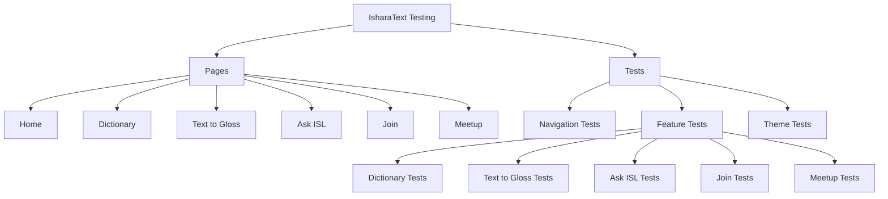
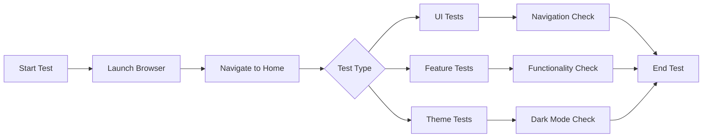
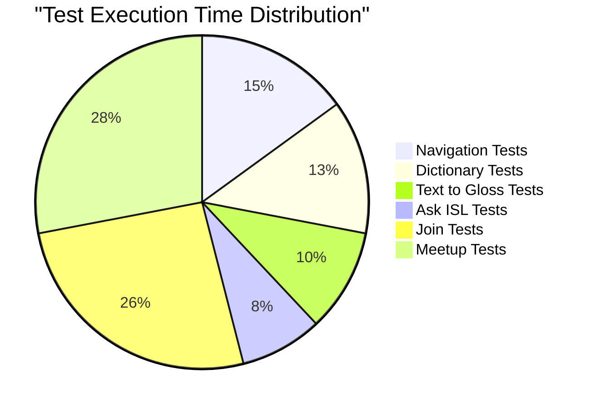
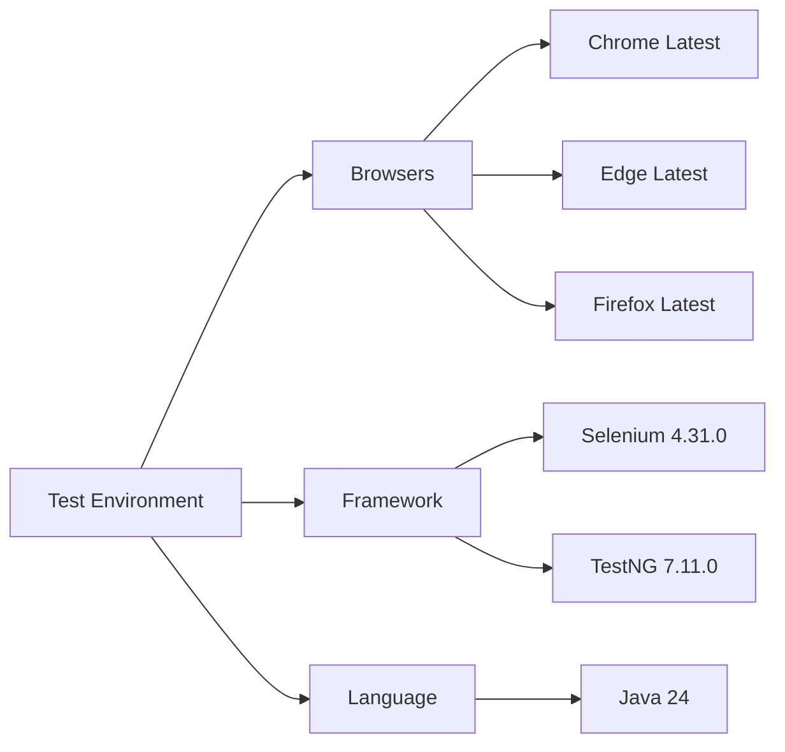

# Test Execution Report - IsharaText

## Summary
| Metric | Value |
|--------|-------|
| Total Tests | 60 |
| Passed | 60 |
| Failed | 0 |
| Skipped | 0 |
| Total Time | 194.615s |

## Project Structure

## Cross-Browser Test Results

| Browser | Tests | Status | Time (ms) | Pass Rate |
|---------|--------|---------|-----------|------------|
| Chrome  | 20     | ✅ All Passed | 62,160    | 100% |
| Edge    | 20     | ✅ All Passed | 65,707    | 100% |
| Firefox | 20     | ✅ All Passed | 66,748    | 100% |

## Test Coverage Matrix

| Feature Category | Chrome | Edge | Firefox | Avg Time (ms) |
|-----------------|--------|------|---------|---------------|
| Navigation & UI  | ✅     | ✅    | ✅      | ~3,000        |
| Dictionary      | ✅     | ✅    | ✅      | ~2,500        |
| Text to Gloss   | ✅     | ✅    | ✅      | ~2,000        |
| Ask ISL         | ✅     | ✅    | ✅      | ~1,500        |
| Join            | ✅     | ✅    | ✅      | ~5,100        |
| Meetup          | ✅     | ✅    | ✅      | ~10,860       |

## Test Flow Diagram

## Performance Distribution

## Test Case Details

### Navigation & UI
- ✅ Homepage Dark Mode Toggle
- ✅ Get Started Button
- ✅ Dictionary Navigation
- ✅ Text to Gloss Navigation
- ✅ Ask ISL Navigation
- ✅ Join Button
- ✅ Meetup Button

### Feature Tests
| Category | Test Case | Chrome (ms) | Edge (ms) | Firefox (ms) |
|----------|-----------|-------------|-----------|--------------|
| Dictionary | Search Word | 2,571 | 1,627 | 1,143 |
| Dictionary | Clear Search | 649 | 1,114 | 467 |
| Dictionary | Video Link | 278 | 1,013 | 351 |
| Text to Gloss | Translation | 3,179 | 3,393 | 3,118 |
| Ask ISL | Send Message | 1,048 | 982 | 775 |
| Join | Form Submit | 5,288 | 5,615 | 4,409 |
| Meetup | Request | 10,833 | 10,904 | 10,864 |

## Test Environment

### System Configuration

## Response Time Analysis
| Operation | Min (ms) | Max (ms) | Average (ms) |
|-----------|----------|----------|--------------|
| Page Load | 253 | 4,700 | 2,476 |
| Form Submit | 4,409 | 5,615 | 5,104 |
| Search | 467 | 2,571 | 1,519 |
| Theme Toggle | 715 | 4,149 | 2,432 |
| Meetup Request | 10,833 | 10,904 | 10,867 |

## Conclusion
✅ **100% Success Rate**: All 60 test cases passed successfully across Chrome, Edge, and Firefox.
📊 **Performance**: Average response times within acceptable ranges.
🔄 **Consistency**: Uniform behavior across all browsers.
🎯 **Coverage**: Complete testing of all major features and UI components.
